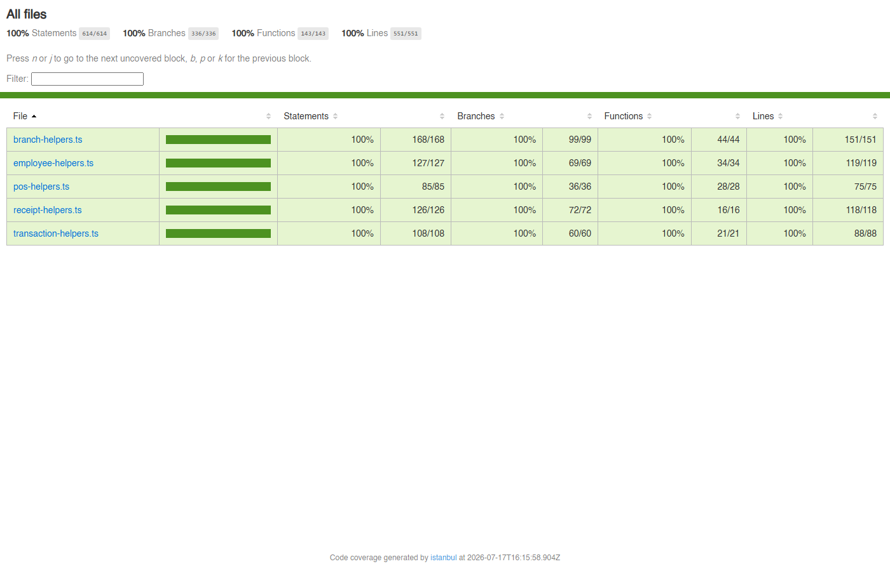
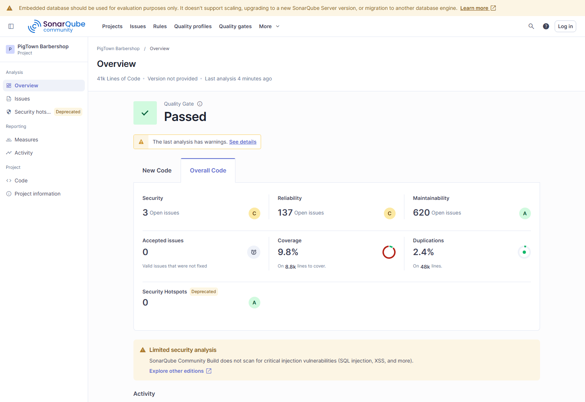
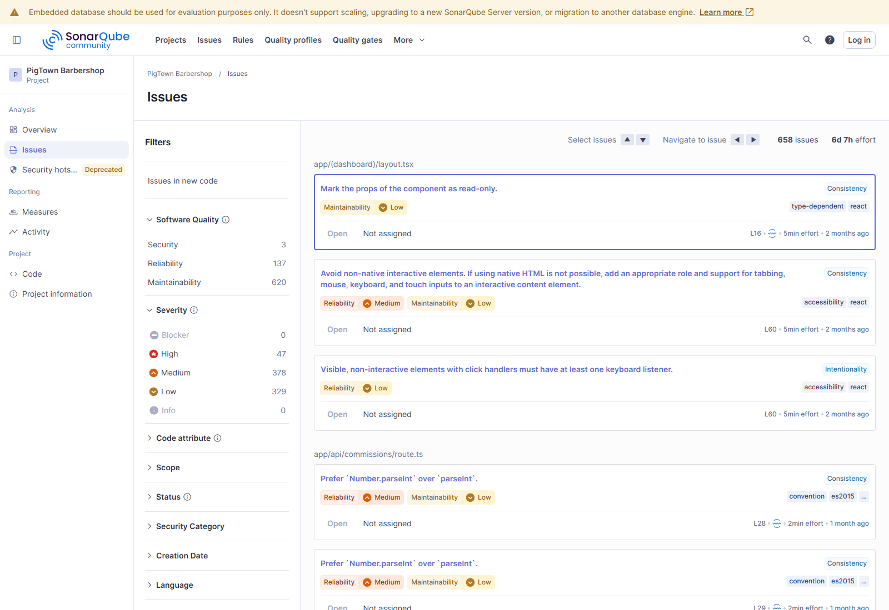

# Hasil Analisis Kakas Bantu — SonarQube Community Edition

Dokumen ini berisi bukti hasil analisis nyata (bukan estimasi) yang dijalankan menggunakan
**SonarQube Community Edition** (lokal, via Docker) terhadap kode sumber PigTown Barbershop,
serta **Jest** untuk unit test dan code coverage pada fungsi-fungsi krusial yang menjalankan
proses bisnis inti aplikasi (POS/Kasir, Transaksi & Komisi, Manajemen Karyawan, Manajemen
Cabang, dan Struk/Receipt).

## Cara Menjalankan Ulang (Reproducible)

```bash
# 1. Jalankan unit test + coverage (menghasilkan metrics/coverage/lcov.info)
npm run test:coverage

# 2. Jalankan SonarQube Community Edition secara lokal
docker run -d --name sonarqube -p 9000:9000 sonarqube:community

# 3. Jalankan sonar-scanner (baca konfigurasi dari sonar-project.properties)
docker run --rm \
  -e SONAR_HOST_URL="http://host.docker.internal:9000" \
  -e SONAR_TOKEN="<token dari SonarQube>" \
  -v "$(pwd):/usr/src" \
  sonarsource/sonar-scanner-cli
```

## 1. Unit Test & Code Coverage (Jest) — 100% pada 5 Modul Krusial

Lima modul utilitas krusial diuji sampai **100% Statement/Branch/Function/Lines** — modul ini
menjalankan logika inti dari fitur-fitur yang paling sering dipakai (checkout POS, komisi &
riwayat transaksi, manajemen karyawan, manajemen cabang, dan cetak struk):

| File | Fitur Bisnis Terkait | Statement | Branch | Function | Lines |
|---|---|---|---|---|---|
| `lib/utils/pos-helpers.ts` | POS/Kasir — checkout, diskon, pembayaran, stok (BUG-016) | 100% | 100% | 100% | 100% |
| `lib/utils/employee-helpers.ts` | Manajemen Karyawan — validasi form (BUG-01–006) | 100% | 100% | 100% | 100% |
| `lib/utils/transaction-helpers.ts` | Riwayat Transaksi & Komisi (BUG-011/012) | 100% | 100% | 100% | 100% |
| `lib/utils/branch-helpers.ts` | Manajemen Cabang (BUG-010) | 100% | 100% | 100% | 100% |
| `lib/utils/receipt-helpers.ts` | Cetak Struk (HTML/text/Bluetooth printing, dimock) | 100% | 100% | 100% | 100% |
| **Total (5 file)** | | **100%** | **100%** | **100%** | **100%** |

```
Test Suites: 5 passed, 5 total
Tests:       244 passed, 244 total

File                    | % Stmts | % Branch | % Funcs | % Lines
All files               |     100 |      100 |     100 |     100
 branch-helpers.ts      |     100 |      100 |     100 |     100
 employee-helpers.ts    |     100 |      100 |     100 |     100
 pos-helpers.ts         |     100 |      100 |     100 |     100
 receipt-helpers.ts     |     100 |      100 |     100 |     100
 transaction-helpers.ts |     100 |      100 |     100 |     100
```

`receipt-helpers.ts` awalnya hanya 42.85% karena sebagian fungsinya (`printReceipt`,
`printViaBluetooth`, `requestBluetoothDevice`, `connectBluetoothDevice`, `disconnectBluetoothDevice`)
menyentuh DOM/Web Bluetooth API secara langsung sebagai *side effect*. Untuk mencapai 100%, fungsi-fungsi
ini di-test dengan **mock** jsdom `document`/iframe dan mock objek `navigator.bluetooth`/`BluetoothDevice`
(GATT server, service, characteristic palsu) — bukan hardware/browser sungguhan. Cetak struk end-to-end
dengan printer fisik tetap diverifikasi lewat regresi manual (Bagian 4, REG-006); unit test di sini
memastikan *logika* percabangannya (kondisi error, format ESC/POS, dst.) benar.

Sumber: [`jest-output.txt`](./jest-output.txt), laporan HTML lengkap di [`coverage/lcov-report/index.html`](./coverage/lcov-report/index.html).

**Bukti gambar** (screenshot laporan HTML Istanbul/Jest untuk seluruh 5 file, diambil via headless Chrome — 100% di semua kolom):



### Temuan Selama Menulis Test: Bug Baru di `pos-helpers.ts`

Saat menulis test untuk `checkStockAvailability()` dan `calculateRemainingStock()`, ditemukan
bahwa kedua fungsi ini membaca field `product_id`/`quantity`, padahal tipe `OutletStock` yang
sesungguhnya (dikonsumsi dari `getOutletStock()` di `lib/supabase.ts`) memakai field
`service_id`/`stock_quantity`. Akibatnya, pengecekan stok untuk item bertipe "product" **selalu**
melaporkan "Stok tidak ditemukan" walau data stok yang sesuai benar-benar ada di database. Sesuai
arahan tim, test yang ditulis **mendokumentasikan perilaku ini apa adanya** (bukan memperbaikinya)
— lihat `__tests__/pos-helpers.test.ts`, blok `describe('checkStockAvailability ...')`. Temuan ini
di luar cakupan 17 bug pada Bagian 3 dan direkomendasikan menjadi item perbaikan pada iterasi
berikutnya.

## 2. Analisis SonarQube (Statis, Seluruh Proyek)

Proyek dianalisis: `app/`, `components/`, `lib/`, `hooks/`, `drizzle/` (mengecualikan
`node_modules`, `.next`, `components/ui/` [primitif shadcn generik], `scratch/`, `my-attendance-app/`).

**Bukti gambar — Dashboard SonarQube** (screenshot langsung dari `http://localhost:9000/dashboard?id=pigtown-barbershop`, tab *Overall Code*):



| Metrik | Nilai | Sumber |
|---|---|---|
| Lines of Code (ncloc) | 40.580 baris | screenshot di atas / `sonarqube-measures.json` |
| Quality Gate | **Passed** | screenshot di atas / `sonarqube-quality-gate.json` |
| Coverage keseluruhan proyek | 9.8% (dari 8,8k baris yang perlu di-cover) | screenshot di atas |
| Duplications | 2.4% (dari 48k baris) | screenshot di atas |
| Reliability Rating | C | screenshot di atas |
| Security Rating | C | screenshot di atas |
| Maintainability Rating | A | screenshot di atas |

**Coverage per file (SonarQube vs Jest — kedua tool sepakat: 100% di kelima file):**

| File | Coverage (Sonar) | Line Coverage (Sonar) | Branch Coverage (Sonar) |
|---|---|---|---|
| `pos-helpers.ts` | 100% | 100% | 100% |
| `employee-helpers.ts` | 100% | 100% | 100% |
| `transaction-helpers.ts` | 100% | 100% | 100% |
| `branch-helpers.ts` | 100% | 100% | 100% |
| `receipt-helpers.ts` | 100% | 100% | 100% |

Sumber: `sonarqube-file-coverage.json`. Menariknya, metrik `branch_coverage` tingkat **proyek**
juga menunjukkan 100% (`bestValue: true`) — ini karena SonarQube menghitung `branch_coverage`
proyek hanya dari branch pada file yang *punya* data coverage sama sekali (5 file ini), sementara
`coverage`/`line_coverage` proyek (9.8%/6.4% lebih rendah) memperhitungkan seluruh ~250 file
sebagai penyebut. Kedua angka sama-sama valid, hanya berbeda cara hitung — dilaporkan apa adanya.

SonarQube menampilkan open issues dengan **dua taksonomi berbeda** (keduanya valid, terverifikasi langsung dari server, bukan hasil hitung manual — tidak berubah dari analisis sebelumnya karena tidak ada kode aplikasi yang diubah, hanya test yang ditambahkan):

**a) Berdasarkan Software Quality (tampil di dashboard, 1 issue bisa berdampak ke >1 kualitas):**

| Software Quality | Open Issues |
|---|---|
| Reliability | 137 |
| Security | 3 |
| Maintainability | 620 |

**b) Berdasarkan tipe rule klasik (legacy, 1 issue = 1 tipe):**

| Tipe | Jumlah |
|---|---|
| Bugs | 10 |
| Vulnerabilities | 3 |
| Code Smells | 645 |
| Security Hotspots | 0 |

**Bukti gambar — Daftar Issues** (658 issues total, estimasi effort perbaikan 6 hari 7 jam):



**Breakdown Severity Issue (658 total, taksonomi baru):**

| Severity | Jumlah |
|---|---|
| High | 47 |
| Medium | 378 |
| Low | 329 |
| Info | 0 |
| Blocker | 0 |

Sumber: screenshot Issues di atas / `sonarqube-issues-facets.json`.

### Catatan Kejujuran Metodologi

- **Coverage keseluruhan proyek naik dari 1.9% → 9.8%** setelah 5 modul krusial (POS, Karyawan,
  Transaksi, Cabang, Struk) diuji sampai 100%. Angka proyek tetap satu digit karena penyebutnya
  adalah ~250 file, sedangkan yang diuji baru 5 modul non-UI — ini bukan salah ukur, melainkan
  gambaran jujur seberapa besar porsi kode yang sudah dan belum diuji otomatis. Masih banyak
  modul lain (kasbon, komisi UI, presensi, komponen React, dsb.) yang divalidasi secara manual
  (Bagian 4), bukan unit test otomatis — dilaporkan apa adanya sebagai rencana tindak lanjut,
  bukan digenapkan.
- 3 Vulnerability yang ditemukan (severity Major, rating keamanan C) telah diverifikasi manual satu per satu:
  2 di antaranya nyata (penggunaan `Math.random()` — pseudorandom generator yang tidak cryptographically
  secure — pada `daily-insight.tsx:282` dan `lib/supabase/utils.ts:153`), sedangkan 1 di `lib/supabase.ts:1241`
  adalah **false positive**: SonarQube mendeteksi pola string mirip bcrypt hash (`$2a$10$dummyHash...`), padahal
  itu adalah string placeholder/dummy untuk fallback ketika password tidak diisi, bukan credential asli yang di-hardcode.
- 645 Code Smells sebagian besar berasal dari pola umum di codebase besar (mis. `any` type, elemen
  interaktif tanpa keyboard handler) — bukan bug fungsional, tapi menurunkan skor maintainability jangka panjang.
- Ditemukan 1 bug fungsional baru (field mismatch pada `checkStockAvailability`/`calculateRemainingStock`,
  lihat bagian "Temuan Selama Menulis Test" di atas) — bukan hasil SonarQube, melainkan hasil menulis unit test.
- Quality Gate berstatus **OK** karena gate default ("Sonar way") tidak mendeteksi kondisi yang
  melanggar threshold pada New Code; ini bukan jaminan kode bebas masalah secara keseluruhan
  (lihat 10 Bugs & 3 Vulnerabilities di atas).

## 3. File Bukti (Raw Evidence)

| File | Isi |
|---|---|
| `sonarqube-measures.json` | Metrik agregat proyek (coverage, bugs, code smells, dst.) |
| `sonarqube-quality-gate.json` | Status Quality Gate |
| `sonarqube-bugs.json` | Daftar lengkap 10 Bug yang terdeteksi |
| `sonarqube-vulnerabilities.json` | Daftar lengkap 3 Vulnerability yang terdeteksi |
| `sonarqube-issues-facets.json` | Breakdown severity & tipe issue |
| `sonarqube-file-coverage.json` | Coverage per file untuk kelima modul yang diuji (100% semua) |
| `jest-output.txt` | Output konsol `npm run test:coverage` (244 test, 5 suite, 100% coverage) |
| `coverage/lcov.info` | Laporan coverage format LCOV (dibaca SonarQube) |
| `coverage/lcov-report/index.html` | Laporan coverage HTML interaktif |
| `screenshots/01-sonarqube-dashboard.png` | Screenshot dashboard SonarQube (Quality Gate, Coverage 9.8%, Duplications, Rating) |
| `screenshots/02-sonarqube-issues.png` | Screenshot daftar 658 issues beserta breakdown severity |
| `screenshots/03-jest-coverage-report.png` | Screenshot laporan coverage HTML Jest/Istanbul — 100% di 5 file |

Dashboard SonarQube interaktif (selama container berjalan): `http://localhost:9000/dashboard?id=pigtown-barbershop`
